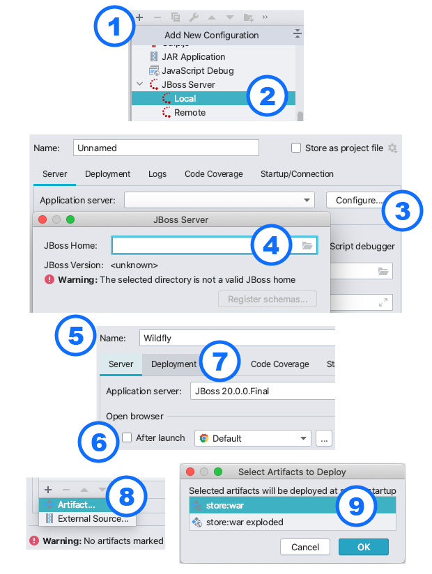
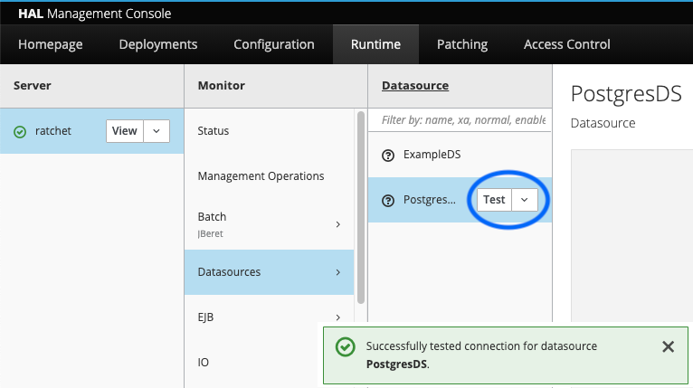

# A Complete Introduction to Java EE

This README is a summary of the following article: https://www.jessym.com/articles/a-complete-introduction-to-java-ee

## Prerequisites

 - Wildfly 20 (https://www.wildfly.org/downloads/, simply download and extract)
 - Java 11 (reason: Wildfly 20 doesn't officially support newer versions)
 - Docker
 - IntelliJ
 
## Wildfly Setup

 1. Via the command line, navigate to the `bin` folder of your Wildfly distribution `cd ~/Downloads/wildfly-20.0.0.Final/bin/`
 2. Create a management user via the `./add-user.sh` script where you'll be asked to provide a username and password
 3. Once the Wildfly server is running (see next steps), you'll be able to manage the application server via the console at http://localhost:9990, using the credentials you've picked in the previous step

## Hello World
 
 1. Create an [index.html](src/main/webapp/index.html) welcome page inside `src/main/webapp/`, containing a simple H1 header tag
 2. Create a [web.xml](src/main/webapp/WEB-INF/web.xml) file inside `src/main/webapp/WEB-INF/` to whitelist the `index.html` file so it can be accessed
 3. Create a [jboss-web.xml](src/main/webapp/WEB-INF/jboss-web.xml) file inside `src/main/webapp/WEB-INF/` to set the application's context root to something like `/store`, for example

## Command Line Deployment

 1. Add the `org.apachage.maven.plugins : maven-war-plugin` to your [pom.xml](pom.xml) file
 2. Run `mvn package` (or `./mvnw package`) and note down the location of your `war` file (something like `target/store-1.0.0.war`)
 3. Navigate to the `bin` folder of your Wildfly distribution `cd ~/Downloads/wildfly-20.0.0.Final/bin/`
 4. Start the application server via the `./standalone.sh` script
 5. From the same `bin` folder, (re-)deploy the latest version of your application via the command `./jboss-cli.sh -c --command="deploy ~/dir/to/store-1.0.0.war --force"`
 6. Visit http://localhost:8080/store to view your HTML welcome page (here, `/store` refers to the context root configured earlier)

## IntelliJ Deployment

 1. Create a new Run/Debug configuration via the menu "Run" -> "Edit Configurations..." and click the little plus (+) sign
 2. Choose JBoss Server (Local)
 3. Click to "Configure..." button to configure the application server
 4. Click the directory icon to select your unzipped Wildfly distribution (e.g.: `~/Downloads/wildfly-20.0.0.Final/`)
 5. Specify a name for the Run/Debug configuration (optional)
 6. Untick the open-browser-after-launch box (optional)
 7. Open the "Deployment" tab
 8. In the bottom-left corner, click the plus (+) sign and click "Artifact..." to select a deployment artifact
 9. Select the (non-exploded) "war" module of your application and click "OK"
 10. Click "Apply" and "Run/Debug" to start the application server and deploy your application
 11. Visit http://localhost:8080/store to view your HTML welcome page (here, `/store` refers to the context root configured earlier)
 

## Deployment Artifacts (.jar, .war, .ear)

 1. Applications running in a Java EE application server (like Wildfly) might contain:
    - frontend components (i.e.: web / HTTP components, like JSP pages)
    - backend components (i.e.: business logic in the form of EJBs)
 2. The frontend (web) components and resources will be accessible via some URL at a certain `context-root` (specified via the [jboss-web.xml](src/main/webapp/WEB-INF/jboss-web.xml) file)
 3. The backend (business logic) components will be made available to frontend components, but wouldn't be directly available over some URL themselves (think for example: backend scheduling systems, business report generation systems, etc.)
 4. Traditionally:
    1. all frontend (web / HTTP) components would be packaged into a **.war** file (Web Application Archive)
    2. all backend (business logic / EJB) components would be packaged into a **.jar** file (Java Archive)
    3. the .war and .jar files would be put together into a **.ear** file (Enterprise Application Archive)
 5. The .ear format was originally created for the application server to provide isolation at the classloader-level between frontend and backend components; Wildfly makes sure that frontend classes can access backend classes, but not the other way around (business logic is not allowed to depend on view logic)
 6. I recommend **only** using the .war deployment artifact, and **never** using the .ear deployment artifact:
    1. proper frontend/backend isolation can be achieved just as easily with a proper Maven module setup
    2. pretty much all Java EE features can be used from a single .war deployment artifact (EJBs, CDI, JPA, JMS, etc.)

## REST Endpoints (JAX-RS)

 1. Create a class [like this](src/main/java/com/jessym/store/WebApplication.java) which extends `javax.ws.rs.core.Application`
 2. Annotate the class with `@javax.ws.rs.ApplicationPath("/api")`
 3. Note that all HTTP endpoints will now be placed under `http://localhost:8080/store/api/**`, where `/store` refers to the context root, and `/api` refers to the application path we've just configured
 4. Follow the example of [this class](src/main/java/com/jessym/store/resources/PingResource.java) to create a simple ping endpoint
 
## JSON Binding

 1. To return JSON from a JAX-RS endpoint, annotate the class or method with `@javax.ws.rs.Produces(MediaType.APPLICATION_JSON)`
 2. To accept incoming JSON at a POST, PUT, PATCH or DELETE endpoint, annotate the class or method with `@javax.ws.rs.Consumes(MediaType.APPLICATION_JSON)`
 
## Bean Validation

 1. For `@POST`-annotated JSON-consuming HTTP endpoints, the incoming request argument should be annotated with `@Valid` to have incoming request bodies automatically validated
 2. As shown by [this example](src/main/java/com/jessym/store/resources/dto/RegisterAccountRequest.java), a custom request POJO can have its properties decorated by (a combination of) annotations like `@NotBlank`, `@Max(120)` and `@Email`

## Beans, Scopes and Injection (CDI)

Recommended CDI Scopes (not automatically part of Wildfly's container-wide transaction management):
 1. `@javax.enterprise.RequestScoped` (each bean instance is tied to a single HTTP request)
 2. `@javax.enterprise.SessionScoped` (each bean instance is tied to a single HTTP session)
 3. `@javax.enterprise.ApplicationScoped` (there's a single bean instance in the entire application)

Recommended EJB Scopes (automatically part of Wildfly's container-wide transaction management):
 1. `@javax.ejb.Stateless` (there's a pool of bean instances, without any guarantee about which particular instance will be invoked)
 2. `@javax.ejb.Singleton` (there's a single bean instance in the entire application)
 
## Local PostgreSQL Setup via Docker

 1. Make sure you have both `docker` and `docker-compose` installed
 2. Create a [docker-compose.yaml](docker-compose.yaml) file at the root of your project
 3. Run `docker-compose up` from the root of your project to create and start a new Postgres instance with the configured credentials

## Registering PostgreSQL as a Data Source

 1. Download the PostgreSQL driver (jar file) from https://jdbc.postgresql.org/download.html
 2. Navigate to the `bin` folder of your Wildfly distribution (`cd ~/Downloads/wildfly-20.0.0.Final/bin/`)
 3. Start a JBoss CLI session by running the `./jboss-cli.sh -c` command (make sure the server is running)
 4. Register Postgres as a module and data source by executing the following three commands inside the CLI session:
    1. `module add --name=org.postgresql --resources=~/Downloads/postgresql-42.2.16.jar --dependencies=javax.api,javax.transaction.api`
    2. `/subsystem=datasources/jdbc-driver=postgres:add(driver-name="postgres",driver-module-name="org.postgresql",driver-class-name="org.postgresql.Driver")`
    3. `data-source add --jndi-name=java:jboss/datasources/PostgresDS --name=PostgresDS --connection-url=jdbc:postgresql://localhost:5432/postgres --driver-name=postgres --user-name=admin --password=password`
    4. Make note of the data source's JNDI name (`java:jboss/datasources/PostgresDS`), so you'll be able to reference it from your persistence unit and/or Java beans later on
    5. All of these settings can be found and edited inside the `standalone/configuration/standalone.xml` configuration file of your Wildfly distribution
 5. To verify the connection, make sure Postgres is running and open the Wildfly management console at http://localhost:9990 (using the credentials configured earlier via the `./add-user.sh` script)
 6. Under the "Runtime" tab, click the name of your machine (under "Server"), click on "Datasources", click on "PostgresDS" and then click on the small "Test" button to verify your connection

## Persistence and Entities (JPA)

 1. Create a [persistence.xml](src/main/resources/META-INF/persistence.xml) file inside the `src/main/resources/META-INF/` folder
 2. Create a new `<persistence-unit>` and decide on:
    - a `name` for it (used for referencing the unit from Java beans)
    - a `transaction-type`, either `JTA` (if you want this unit to hook into Wildfly's container-wide transaction management) or `RESOURCE_LOCAL` (if you want this unit to manage its own JDBC-level transactions in isolation)
 3. To link this persistence unit to a particular data source, add the `<jta-data-source>` tag to the unit's XML configuration, and reference the data source by JNDI name
 4. Certain Hibernate-specific (non-JPA-standard) properties can be added to the persistence unit XML configuration, for things like:
    - Setting the dialect to `PostgreSQL95Dialect`, for example
    - Setting the default Postgres _schema_ for the data source's database to `public`, for example
 5. Create a JPA entity [like this](src/main/java/com/jessym/store/model/Account.java) by using the `@Entity` annotation
 6. Inject an `EntityManager` instance into one of your (repository or DAO) beans via the `@PersistenceContext(unitName = "PostgresPU")` annotation (making sure to reference the correct unit defined in your [persistence.xml](src/main/resources/META-INF/persistence.xml) file)
 7. To persist an entity into the database, simply use the entity manager's `persist` method, as shown by [this example](src/main/java/com/jessym/store/persistence/AccountRepository.java)
 8. Keep in mind that this won't work and Wildfly won't find the database table, unless you do one of the following:
    1. manually create the right Postgres tables with the right columns for your entities
    2. add the `hibernate.hbm2ddl.auto` property  with value `update` (see [documentation](https://docs.jboss.org/hibernate/orm/5.2/userguide/html_single/Hibernate_User_Guide.html#configurations-hbmddl)) to your [persistence.xml](src/main/resources/META-INF/persistence.xml) file, in order to automatically generate and update the database tables (based on your Java/JPA entities) during application startup
    3. **recommended**: use a tool like **Flyway** for managing your database migration files and executing them during application startup, so the full database schema is kept under version control as well

## Flyway Database Migrations

 1. Flyway is a tool for automatically executing database migration files against your database upon application startup
 2. Add a Maven compile dependency on the `org.flywaydb : flyway-core` library to [pom.xml](pom.xml)
 3. Create some kind of [FlywayMigrationExecutor](src/main/java/com/jessym/store/persistence/flyway/FlywayMigrationExecutor.java) which hooks into the application startup lifecycle (via the `@javax.ejb.Singleton` and `@javax.ejb.Startup` annotations) and uses the Flyway API to migrate the database
 4. Make sure to inject the correct data source via a JNDI resource lookup, supplying the same JNDI name which was used when registering the data source
 5. Place your actual .SQL migration files ([following the necessary naming conventions](https://flywaydb.org/documentation/migrations#sql-based-migrations)) in the `src/main/resources/db/migration/` folder, which Flyway will automatically scan by default

## Container Transaction Management

 1. By default, all EJBs (defined by annotations like `@javax.ejb.Stateless` and `@javax.ejb.Singleton`) are automatically part of Wildfly's container-wide transaction management
 2. This means that all EJB operations (public methods) are executed in a transactional context, and, if an exception were to occur, will be _rolled back_
 3. So if an EJB successfully saves a new entity into the database and successfully publishes a message to some JMS broker, but later (in the same thread of execution) fails on a `NullPointerException`, both the database operation and the JMS publication will be rolled back
 4. By default, transactional execution is only enabled for EJBs, and not for (ordinary) CDI beans
 5. To _disable_ transactional execution for an EJB, add the class-level `@TransactionManagement(TransactionManagementType.BEAN)` annotation
 6. To _enable_ transactional execution for CDI beans (defined by annotations like `@RequestScoped`, `@SessionScoped` and `@ApplicationScoped`), add the class or method-level `@javax.transaction.Transactional` annotation
